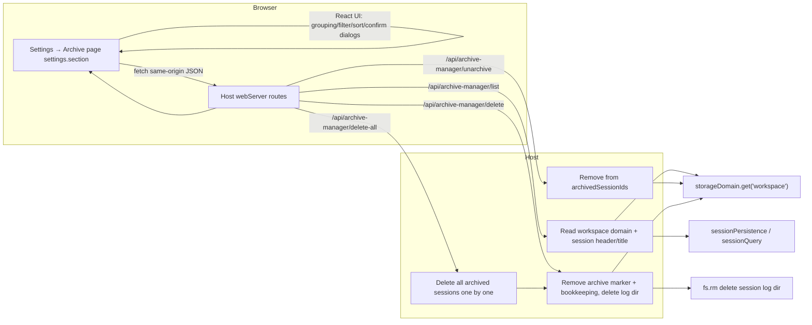

# dsh-archive-manager

[](README.md)
[](README_en.md)

<div align="center">

A DeepSeek Harness (DSH) web-GUI plugin: adds an "Archive" page to the settings window for viewing, filtering, sorting, unarchiving and permanently deleting archived DSH sessions.

[](LICENSE)
[](package.json)
[](https://github.com/deepseek-ai/deepseek-harness)

</div>

---

## 📑 Table of Contents

- [📸 Preview](#-preview)
- [✨ Features](#-features)
- [🚀 Quick Start](#-quick-start)
- [📖 Usage](#-usage)
- [🔧 How It Works](#-how-it-works)
- [⚠️ Technical Notes & Limitations](#️-technical-notes--limitations)
- [⚙️ Configuration](#️-configuration)
- [🤝 Contributing](#-contributing)
- [📄 License](#-license)

---

## 📸 Preview

<!-- Screenshot to be added: the "Archive" page in the settings window (workspace-grouped list + filter/sort toolbar) -->

---

## ✨ Features

| Feature | Description |
|---------|-------------|
| **View archived sessions** | A new "Archive" page in the settings window lists all archived sessions, grouped by workspace; sessions not belonging to any workspace go under "(Unassigned)" |
| **Filter** | Filter archived sessions by "All workspaces", a specific workspace, or "Ungrouped"; the dropdown only lists workspaces that **own at least one archived session**, and the "Ungrouped" option only appears when ungrouped archived sessions exist |
| **Sort** | Sort by session name (alphabetical asc/desc) or by session creation time (asc/desc) |
| **Unarchive** | Removes a session from the archive set; it **reappears in the corresponding workspace group in the left sidebar** and can be opened |
| **Delete (with confirmation)** | Delete a single session, or "Delete all" at once; every delete is guarded by a second confirmation dialog — it only runs after clicking "Confirm delete" |
| **Permanent deletion** | Deletion removes the session log file (`session.jsonl.zstd`), the archive marker and the workspace bookkeeping — irreversible |
| **Bilingual UI** | UI text follows DSH's active language (中文 / English) |

---

## 🚀 Quick Start

### Prerequisites

- DSH CLI and pnpm installed (`dsh plugin` forwards to pnpm internally)

### Install

```sh
# Option 1: install from a local source directory (development)
dsh plugin --profile web add dsh-archive-manager@link:<absolute-path-to-plugin>

# Option 2: install from GitHub
dsh plugin --profile web add github:Ycet/dsh-archive-manager
```

The package declares a `dsh.bundle` patch layer; `dsh plugin` merges the loader entry into the profile's bundle layer automatically — no manual editing of `cordis.patch.yml` required.

### Launch

1. Restart the web app: `dsh web`
2. Open http://127.0.0.1:3080 and refresh the page
3. Click **Settings** at the bottom of the left sidebar, then choose the **Archive** page

> [!NOTE]
> When installed as a `file:` snapshot (copy), re-run the install command after changing the source to refresh the snapshot inside the profile, then restart DSH web for it to take effect (bundle-layer changes always require a DSH restart; they are not hot-reloaded).

---

## 📖 Usage

1. Click **Settings** at the bottom of the left sidebar;
2. Select the **Archive** page on the left of the settings window;
3. Toolbar at the top of the page:
   - **Filter** dropdown: default "All workspaces"; pick a specific workspace or "Ungrouped" to narrow down; the dropdown only lists workspaces that **own at least one archived session** (a workspace with no archived sessions does not appear), and the "Ungrouped" option only appears when ungrouped archived sessions exist;
   - **Sort** dropdown: by name or creation time, ascending or descending;
   - **Delete all** button: deletes every archived session under the current filter (with confirmation);
4. Sessions are grouped by workspace, each group showing session titles and creation times:
   - **Unarchive**: the session returns to its workspace group in the left sidebar and can be reopened;
   - **Delete**: permanently deletes the session after a second confirmation.

---

## 🔧 How It Works

### Underlying storage of archiving in DSH

DSH persists session archive state in `~/.dsh/storages/workspace.json` (the workspace domain):

```jsonc
{
  "global": {
    "initialized": true,
    "workspaceIds": ["..."],
    "archivedSessionIds": ["session-xxx", "..."],
  },
  "tables": {
    "workspaces": {
      "<workspaceId>": {
        "path": "/abs/path",
        "title": "Workspace name",
        "sessionIds": ["..."],
        "createdAt": "...",
        "updatedAt": "..."
      }
    }
  }
}
```

`archivedSessionIds` is the global archive set. Archiving only hides a session from the partition views; it **does not** delete logs or change workspace bookkeeping, so unarchiving restores the session to its original workspace.

### Data flow



After the host writes the `workspace` domain global, DSH validates the domain state on startup (fail-loud). Writes keep the `workspace.json` schema structure strictly unchanged (arrays are replaced wholesale before writing back), so DSH startup is never broken.

---

## ⚠️ Technical Notes & Limitations

- **No official unarchive / delete-session API**: the DSH host `workspaceRegistry` only exposes `archiveSession` — there is no `unarchiveSession` and no "delete session" API. This plugin reads/writes the `storageDomain.get('workspace')` domain store (`~/.dsh/storages/workspace.json`) directly, strictly preserving its schema.
- **Deletion is permanent**: deleting a session removes the log files under `~/.dsh/sessions/<project-dir>/<sessionId>/` — irreversible. DSH's SQLite search index cleans up the session on the next reconciliation.
- **Files are deleted before records are cleared**: deletion first locates the session log directory via the official `sessionPersistence.locate(header)` (falling back to `header.cwd` / workspace bookkeeping paths), and only after the log file deletion **succeeds** does it remove the archive marker and workspace bookkeeping; if log deletion fails (cannot locate, still exists, IO error), it returns an error and **leaves the archive state untouched** — the session stays hidden and does not "resurrect" in the sidebar.
- **Takes effect live**: writing the global triggers `domain/changed`; DSH pushes `host/archived-sessions-changed` to the browser, so the sidebar and the archive page refresh immediately.
- **In-memory cache consistency (fixed)**: DSH's `WorkspaceRegistry` is the single writer and its `archivedSessionIds` getter reads the in-memory `state` directly. When rewriting the store, this plugin **synchronously updates `registry.state.archivedSessionIds`** and uses the official `WorkspaceEntity.detachSession` to remove workspace bookkeeping (also refreshing the entity.record cache); so unarchive → archive cycles and hard-refresh baseline rebuilds never lose or hide sessions.
- **Archived sessions only**: delete/unarchive first validates that the session actually exists in `archivedSessionIds`; non-archived sessions are never touched.
- **Live-session handling (fixed)**: after an agent finishes, its session still stays in DSH memory as a live Session (`ctx.sessions`); deleting files alone does not remove it from the frontend (`session.list` still returns the live part and the sidebar shows it "resurrected"). When deleting a live session: deletion is refused **only if the agent is truly running (`agent.status === "running"`)**; for idle live sessions (agent idle or no agent) it first calls `sessions.detachEntered` to remove it from memory (triggers `session/disposed` → DSH pushes `host/session-removed` → the sidebar removes it immediately, and the agent-loop cleans up the associated idle agent), **then** deletes the files and clears the records (so a later DSH flush cannot write the logs back to disk).

> [!WARNING]
> "Delete" and "Delete all" are **permanent deletions**: the session log file, archive marker and workspace bookkeeping are all removed — **irreversible**.

---

## ⚙️ Configuration

This plugin needs no environment variables or config files — it works out of the box. It adds no public DSH RPC and mounts no new Service; it only registers 4 package-local same-origin HTTP routes:

| Method | Path | Purpose |
| --- | --- | --- |
| `GET` | `/api/archive-manager/list` | Return archived sessions + workspace list |
| `POST` | `/api/archive-manager/unarchive` | Unarchive a single session |
| `POST` | `/api/archive-manager/delete` | Permanently delete a single archived session |
| `POST` | `/api/archive-manager/delete-all` | Permanently delete all archived sessions |

---

## 🤝 Contributing

Issues and pull requests are welcome: report problems with the DSH version, plugin version, reproduction steps and logs at [Issues](https://github.com/Ycet/dsh-archive-manager/issues); for improvements, follow Fork → branch → PR (host changes go to `index.js`, browser changes to `client.js`).

---

## 📄 License

This project is licensed under the [MIT](LICENSE) license.
